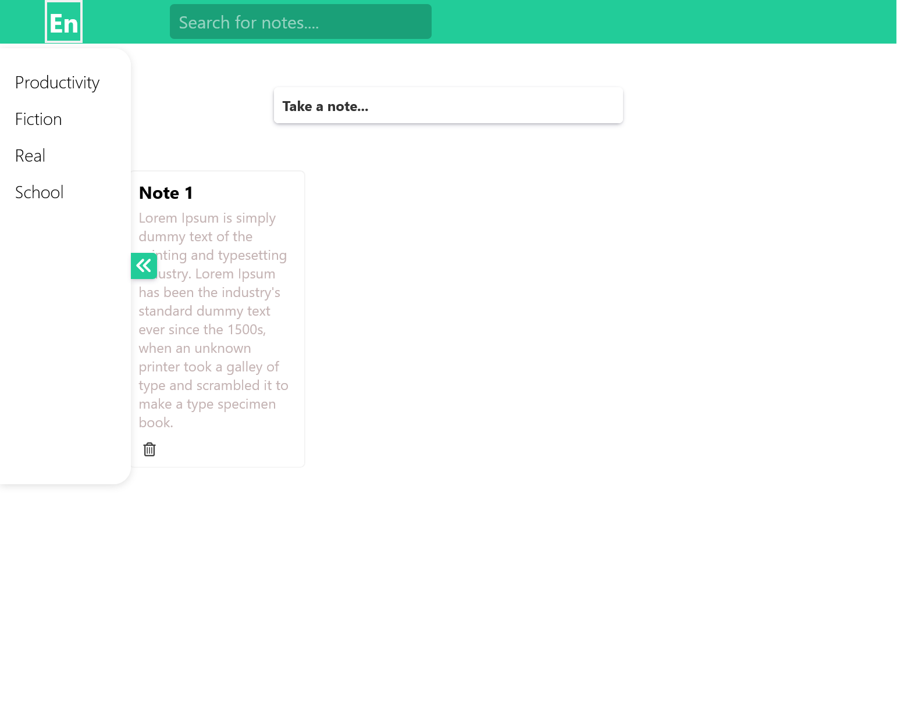

# Advance Note App

- A advance responsive note app made with html,css and javascript.
- Trying to make clone of google keep notes

<a href="https://rishav-mngo.github.io/en-notes-app/">En Notes demo</a>

### Future Goals

- Able to add and render notes according to tags
- Able to search notes by tagName.
- Able to search notes by title.
- Able to Search notes by words from content.
- Adding Database.

## Technologies Used

1. Html
2. Css
3. Javascript

## Contributer

1. Rishav Raj
